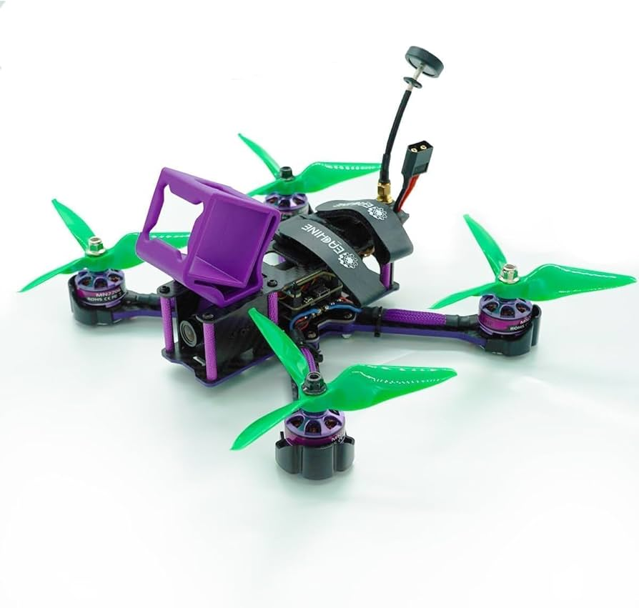

# Практикум цифрового производства. Весна 2025. Предложение проекта

## Название проекта

4х осевой мультикоптер

## Команда

[**Галицын Матвей**](https://github.com/Matvey787)  [galitsyn.md@phystech.edu],
 [**Будицкий Егор**](https://github.com/ZEVS1206)  [buditskii.ea@phystech.edu]

## Цель проекта

Спроектировать и создать 4х осевой мультикоптер на базе Inav. 

## Задачи проекта

- Найти и изучить материал, необходимый для успешной реализации, в интернете.
- Закупить необходимые детали для дрона.
- Закупить необходимое оборудование (в частности для пайки).
- Поэтапно собрать.
- Прошить и откалибровать дрон.
- Собрать весь опыт и полученные навыки в полезный туториал по выращиванию дрона в домашних условиях).

## Существующие аналоги
